

  

<h1 align="center">BhootKosh</h1>

  <strong>The illustrated archive of Indian ghosts, spirits, demons, haunted places &amp; folklore.</strong>

  <em>Where oral legends become a living encyclopedia — bold, cultural, and carefully told.</em>

  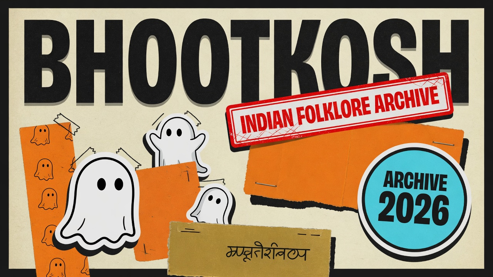

---

## What is this?

**BhootKosh** (*Bhoot* = ghost/spirit · *Kosh* = treasury/archive) is a digital folklore archive for the Indian subcontinent.

It collects the stories people still tell after dark — the **Chudail** at the peepal tree, the **Vetala** in the ruins, the empty streets of **Kuldhara**, the cries at **Shaniwar Wada** — and presents them as **illustrated encyclopedia entries**, not clickbait horror.

This is **culture first**: regional names, contradictory oral versions, disclaimers, and respect for living traditions.

---

## A taste of the archive

### Spirits & beings

|  |  |  |
|:---:|:---:|:---:|
| 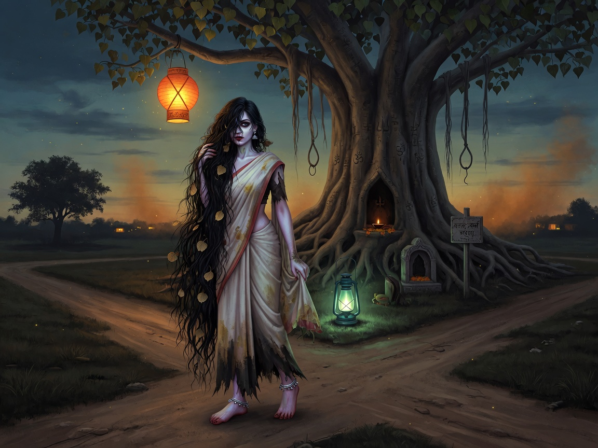 **Chudail** | 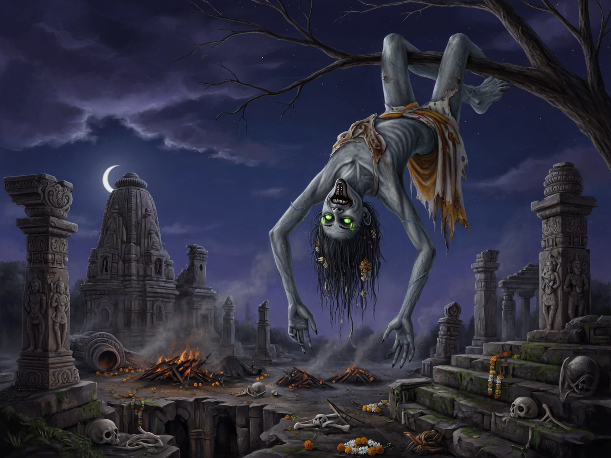 **Vetala** | 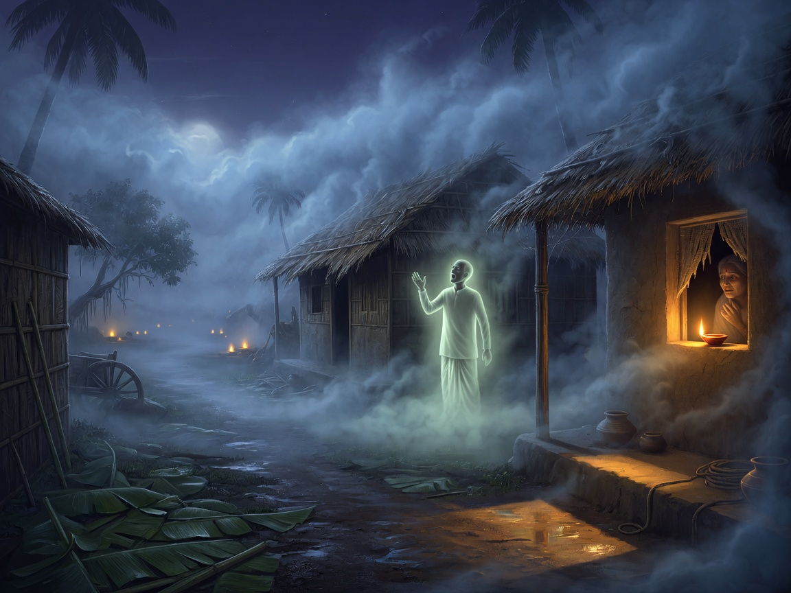 **Nishi Daak** |
| 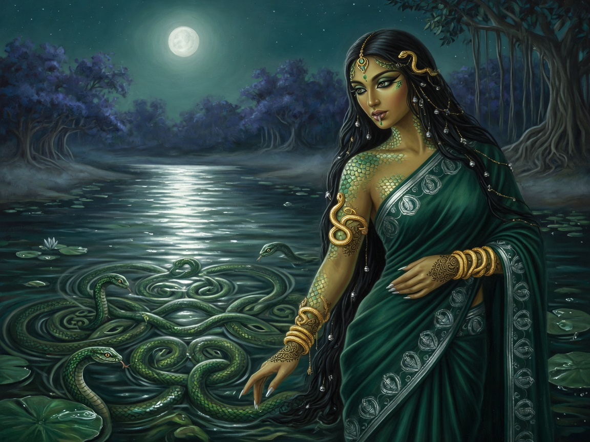 **Nagin** | 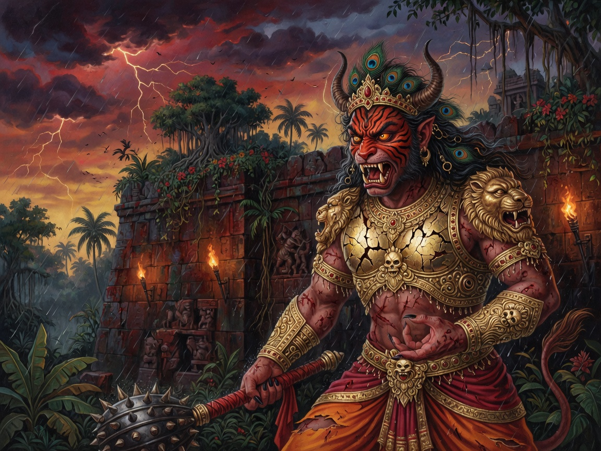 **Rakshasa** | 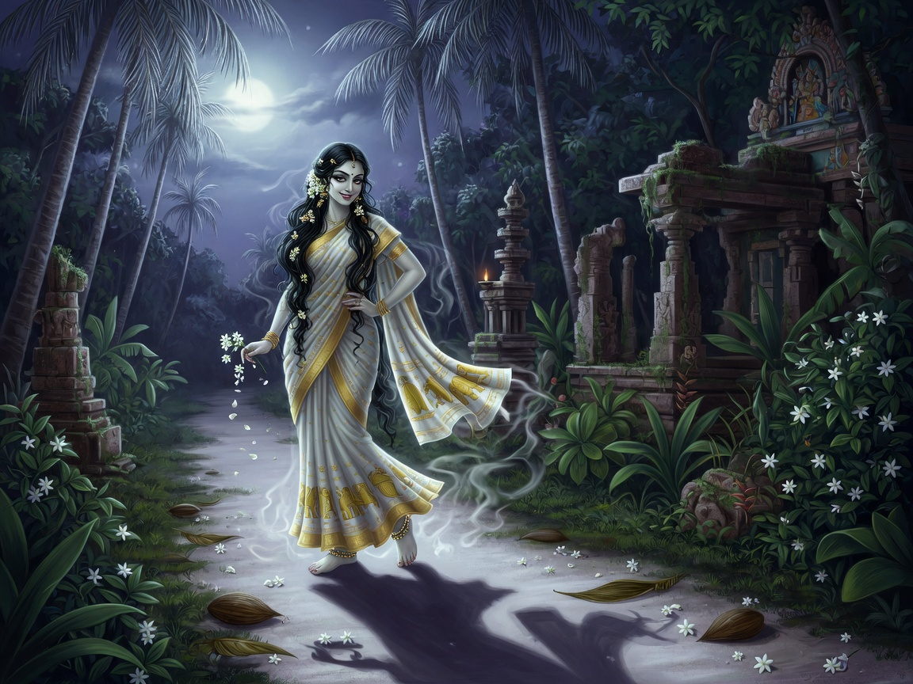 **Mohini Yakshi** |

Fifteen+ illustrated entries across types: female spirits, restless dead, demons, forest & river beings, village lore, shape-shifters, and more.

### Haunted places

|  |  |  |
|:---:|:---:|:---:|
| 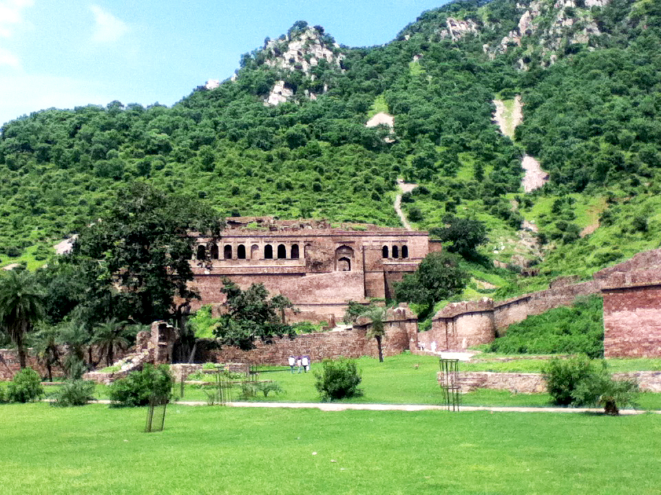 **Bhangarh Fort** · Rajasthan | 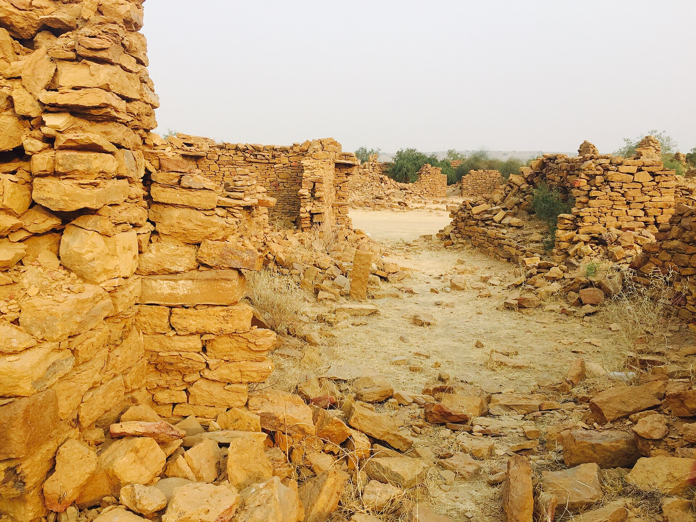 **Kuldhara** · Rajasthan | 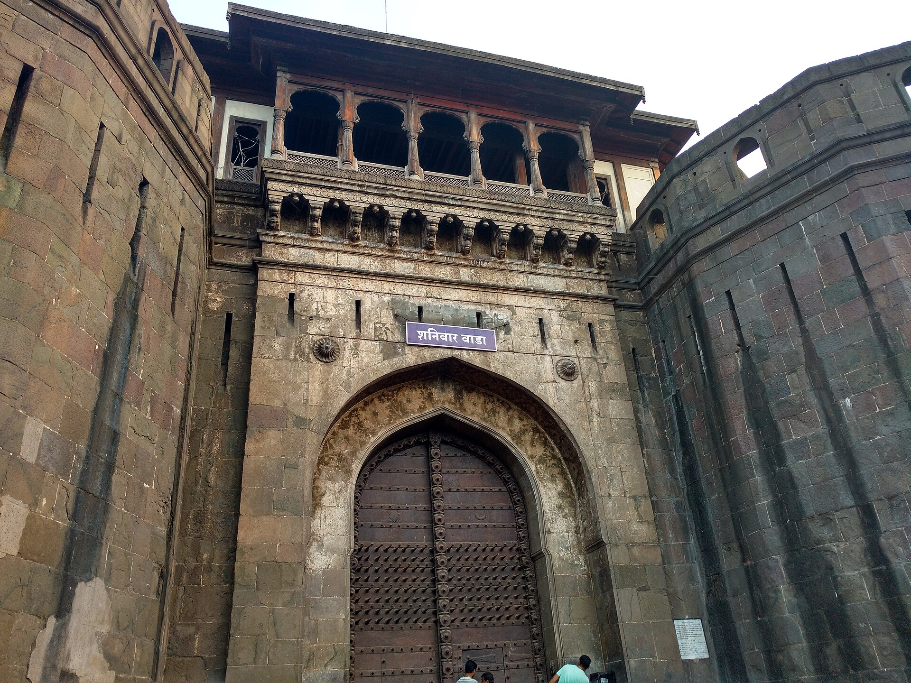 **Shaniwar Wada** · Pune |

Also: **Dumas Beach** (Gujarat), **Dow Hill** (Kurseong), and more — history, legend, and cultural caution, side by side.

### Folklore stories

|  |  |
|:---:|:---:|
| 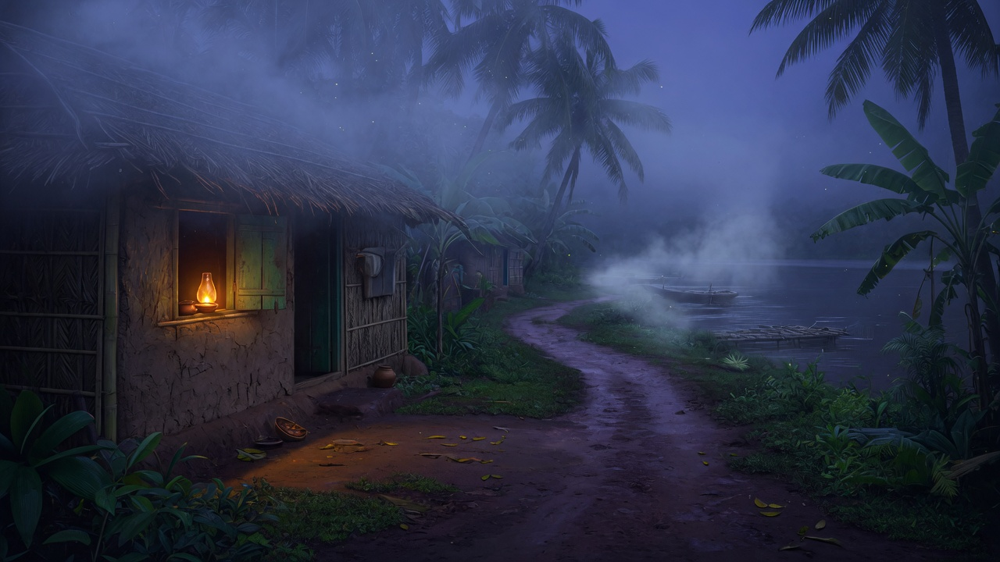 *The Call of Nishi Daak* | 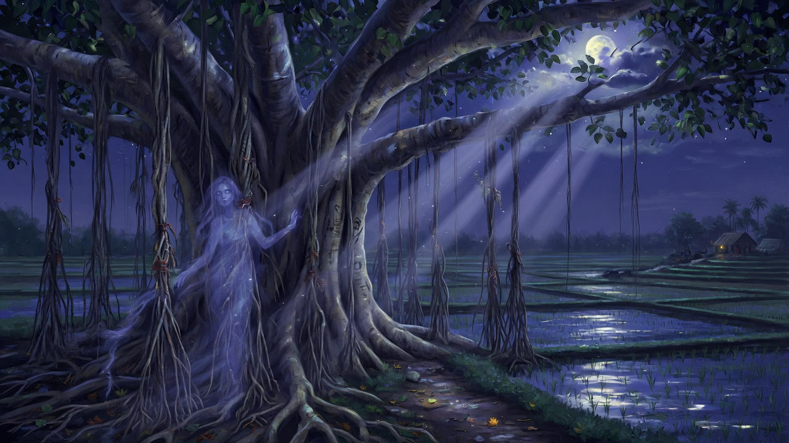 *The Banyan Tree at Midnight* |

Narrative retellings that sit next to encyclopedia facts — the archive’s human voice.

---

## The vibe

  
  &nbsp;&nbsp;
  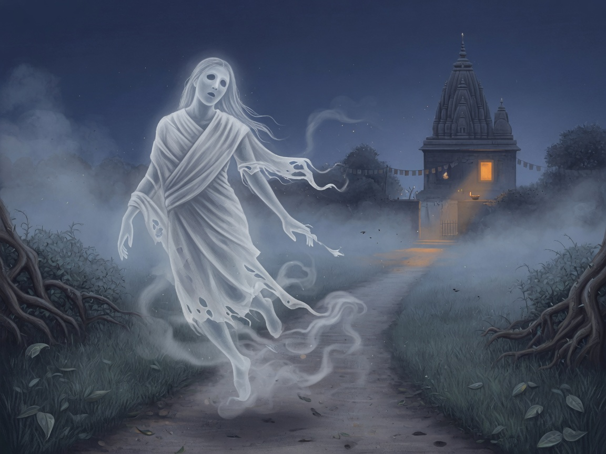

- **Neo-brutal UI** — thick black borders, hard shadows, cream paper, saffron & gold
- **Mobile bottom nav** + desktop sticky filters
- **Interactive India map** — folklore by state
- **Discord-ready embeds** — fat Open Graph cards when you share a link
- **Admin archive desk** — drafts, publish, media, public submissions

This is not a generic horror blog template. It’s an **illustrated treasury** with attitude.

---

## What’s inside

### For readers
- Ghost **encyclopedia** with search, filters, danger levels, regions  
- **Detail pages** for spirits, places, stories  
- **Regions & types** taxonomy  
- **Random spirit** for the curious  
- **Submit a legend** for community contributions (editorial review)

### For editors
- Secure admin login  
- CRUD for ghosts, places, stories, regions, tags  
- Media library  
- Submission review workflow  

---

## Sample roster

**Ghosts:** Chudail · Vetala · Pishacha · Nishi Daak · Brahmadaitya · Yakshini · Daayan · Munjya · Nagin · Preta · Rakshasa · Mohini Yakshi · Pei · Bhoot · Shakchunni  

**Places:** Bhangarh Fort · Kuldhara Village · Dumas Beach · Dow Hill · Shaniwar Wada  

---

## Brand mark

| Logo (SVG) | Stamp / photo mark |
|:---:|:---:|
|  |  |

A classic **sheet ghost** on saffron — neo-brutal borders, gold disc, hard black shadow. Built to read small (favicon) and large (share cards).

---

## Cultural note

BhootKosh is an **educational folklore archive**.

- Legends **vary** by region, language, and teller  
- Entries are **not** scientific claims  
- Haunted-place pages are **cultural narrative**, not travel or safety advice  
- Sensitive topics (e.g. witchcraft accusations) are handled carefully — folklore can touch real harm  

Document with respect. Scare with stories, not with people.

---

## Built with

Next.js · TypeScript · Tailwind · MongoDB + Prisma · Auth.js · TipTap · Cloudinary · a little late-night courage  

---

  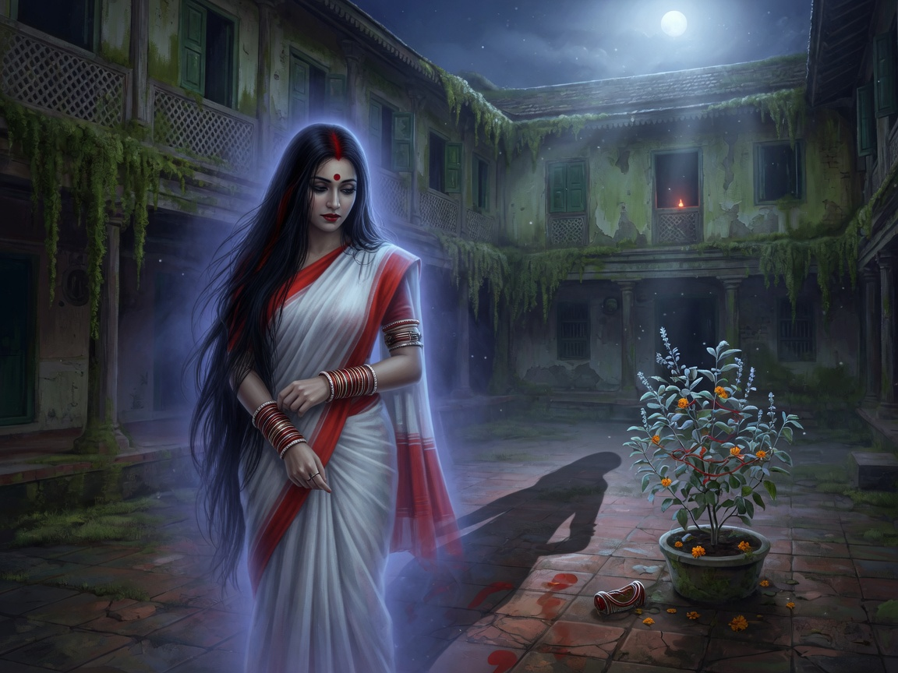

  <strong>◈ BhootKosh</strong> 
  <em>Indian Folklore Archive</em>  
  Private project · All rights reserved unless stated by the owner

